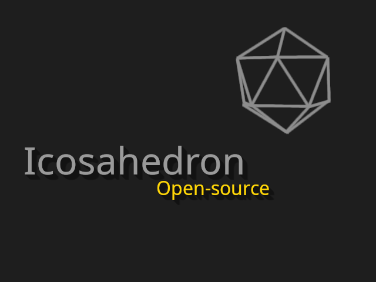

# Icosahedron
A game engine that uses OpenGL for graphics. It is supposed to be for both 2D and 3D applications. This is supposed to be more like a framework that abstracts most of the heavy lifting required for rendering. 

Also, this API tries to keep the number of relationships between its components (coupling) as small as possible, meaning that an utility that fails will not affect all the other elements.

# TODO:

- Add terminal output for Windows platforms. (done)
- Add custom sound attenuation that can also be used to make sounds louder when they are facing the ear direction. ( )
- Add support for multiple windows in one application. ( )
- Add built-in checkboxes, sliders, text fields and dialogs via the ic::UI extension. (done - dialogs can be implemented in the frontend, but I will probably do so that they can also exist on the backend, by using `ic::UI::Table`s) 
- Make event-driven programming accept multiple parameters in functions and also allow it to use methods from classes. ( )
- Add more math functions. (done)
- Allow raycasting for 3D boxes. ( )
- You only need one controller per input device, not 69 quintillion controllers that each do their own thing. ( )
- Reimplement multiple mesh loading in ic::OBJLoader. (done)

# Links:
Discord server: [https://discord.gg/jCCEGpds6V](https://discord.gg/jCCEGpds6V)

# Extensions
Right now, Icosahedron has the `Physics` and `UI` extensions.

# Documentation
See [https://github.com/EmanuelG-Gaming/Icosahedron/wiki](https://github.com/EmanuelG-Gaming/Icosahedron/wiki). The code building section is inside the [https://github.com/EmanuelG-Gaming/Icosahedron/wiki/Quick-start](quick start) chapter. 
